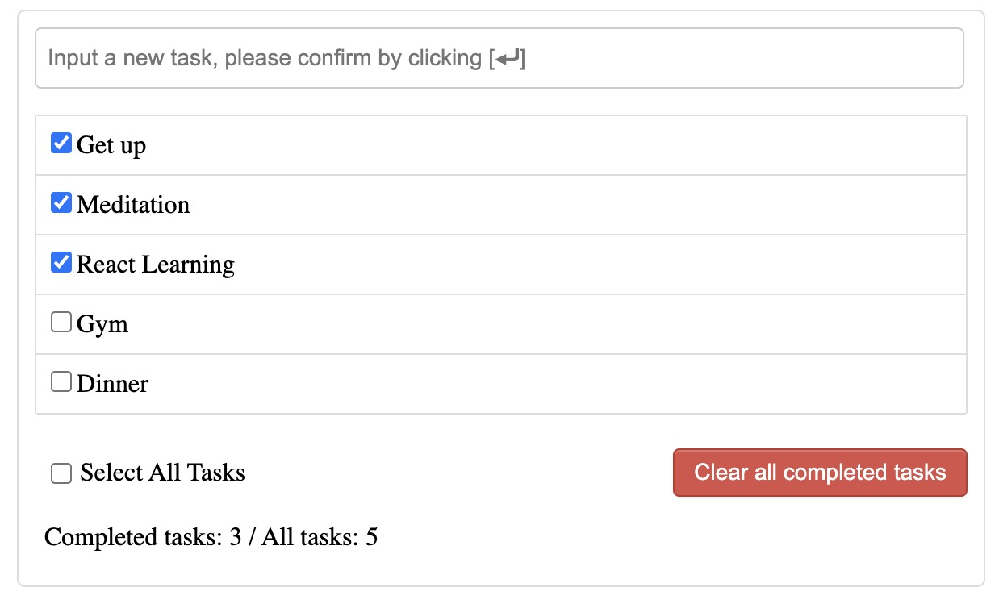
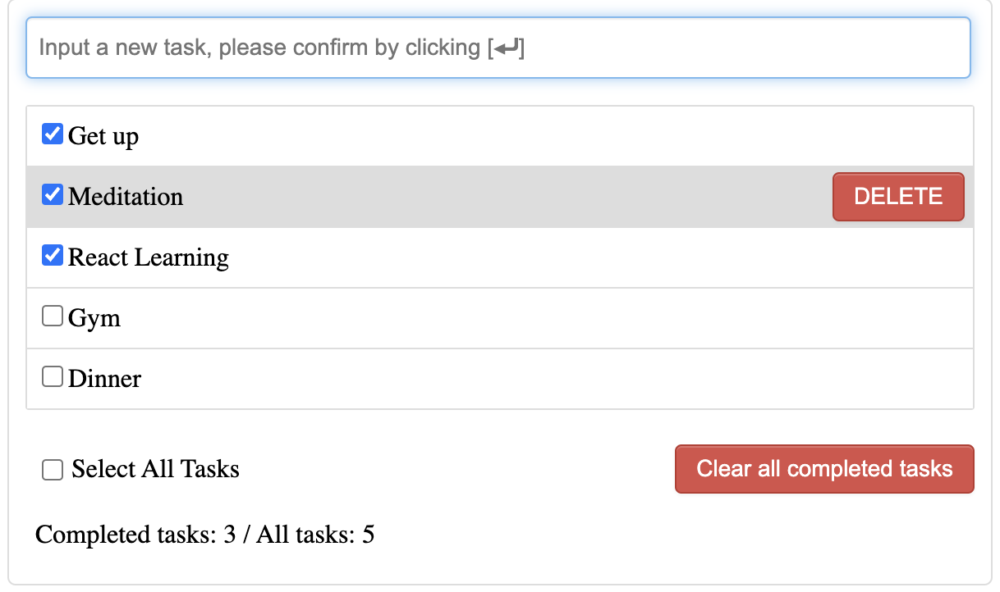

# ----- Task Management App -----
Here presents the ui.  
  
Users can use the app to manage their to-do-list. Adding a new task, removing existing ones, changing task status and etc.  
Main functions:
1. Dynamically displays a list of all tasks.  
Each task has a checkbox on the left of its name, representing its completation status. Checked means it is completed.
2. Add a new task by inputting the task name on app header.  
After pressing [⏎] on keyboard, system will check the validity of user input to avoid empty input. A alert is triggered to warn it.  
Also, restore the input textbox after adding a new task for better user experience so that users do not need to clear the previous input themselves.
3. The number of completed tasks is shown on the footer, a checkbox is used to select all tasks on the list, a button is applied to remove all completed tasks.
4. Delete a single task.  
    When mouse hovers on a task, the item is highlighted in grey and a delete button appears. Click the button to delete the chosen task, a pop-up will show up to confirm the operation.  
  

Clone the project, cd to the document, "npm start" to run.  
