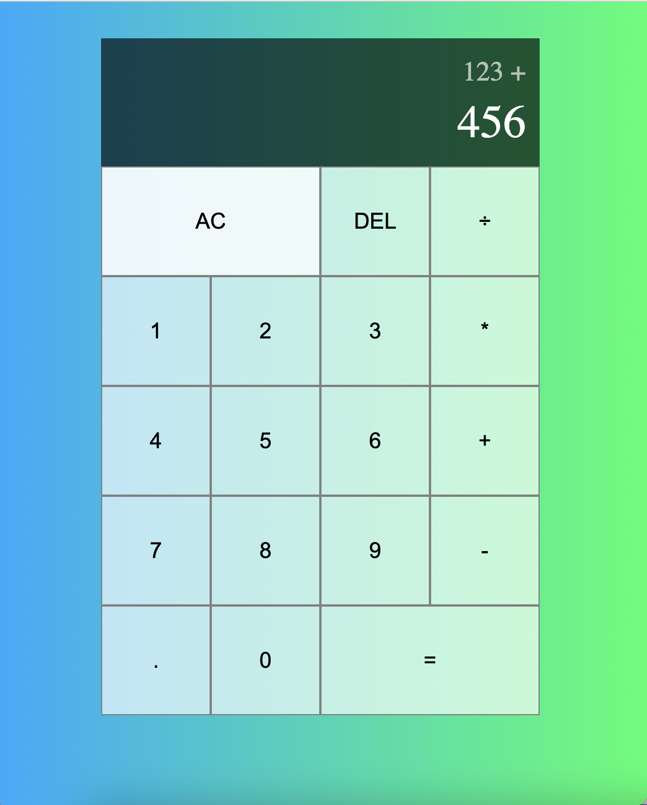

# ----- Calculator -----
Here presents the ui.  
  
This is calculator web app.    

Used Hooks: useState, useReducer  

For funcationalities, it realizes the basic calculations, and store the shared state in reducer.  Many details are taken into consideration, such as use the lasted operation symbol when continuously clicking different ones.  

For UI, set the background color to linear gradient for good appearance, and hightlight the element when mouse hovers for better user experience.

