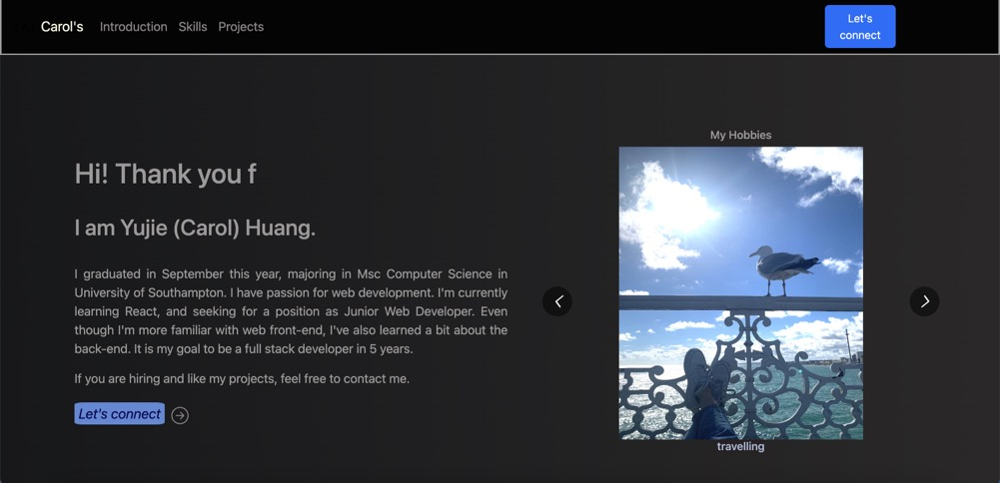

# ----- Personal Website -----
Here presents the ui.  
  
This is the home page of my personal website.  

Main technology used for the app: basic hooks (useState, useEffect, useRef), Bootstrap is chosen for responsiveness.  

There are 3 pages, the first page presents my introduction, the second page shows my skills and previous projects. The last page is a contact form, however, the front-end I created only check if users have filled all inputs, it wouldn't send the form information to back-end since I dont have one :(  

Some animations are utilised by third-party library, some are created by setTimeOut method...
