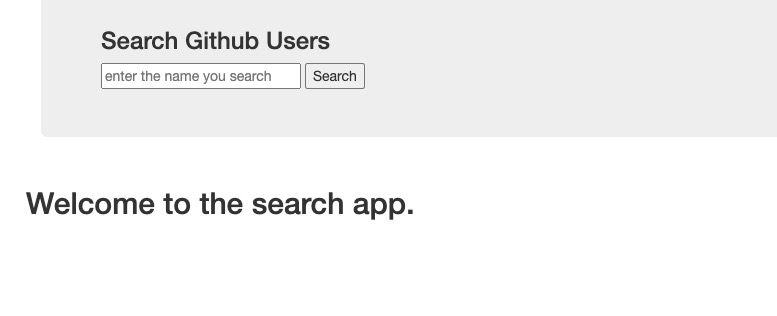
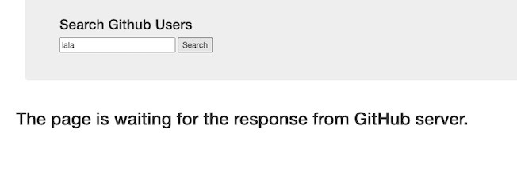
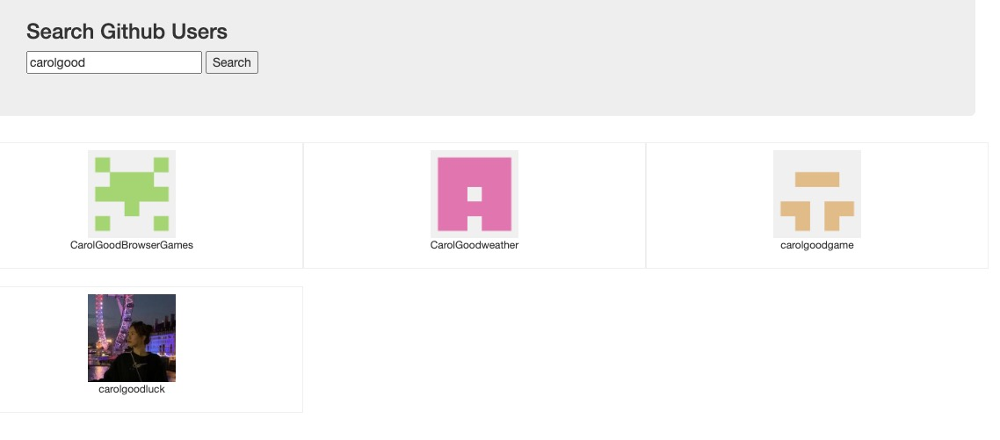
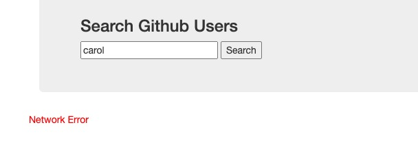

# ----- GitHub Users Search App -----
Here presents the ui.  
  
This app is can be used to find relevant GitHub users through input keywords.  

Main technology used for the app: Axios, PubSub  

Main functions:
1. Search relevant users.  
The web app will send request to GitHub server by Axios. (Did not set proxy especially because GitHub allows cross orgin.)   
2. Display results.  
The display section display has four different information for different stages/status.  
a. Welcome status: It is the initial page as presented above. It only displays when users enters the website, it will no longer appear once users use any function.  
b. Loading status: Show loading information to indicate the HTTP request has been sent, to avoid confusion when it takes a long time to get results due to bad internet.  
  
c. Display status: Show the list of results after users input and click button. It displays detailed user head portrait and username for each item in the list.  Click their head photo will go to their home page.  
  
d. Error status: It will show error information for unexpected response or internet.   
  

  

Clone the project, cd to the document, "npm start" to run.   
(Sometimes the it might display irrelevant resutls, which is caused by GitHub search api. :( ) 
